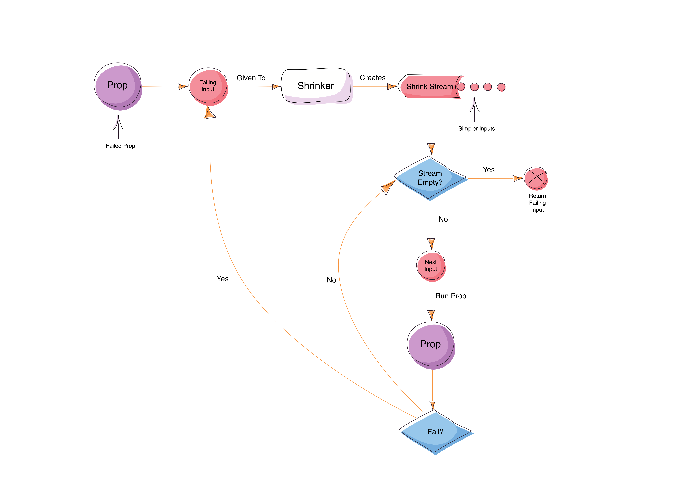

There are a few of different concepts to grapple with when [learning property-based testing](https://github.com/ssanj/intro-to-property-based-testing) (PBT). Generating random inputs, writing properties and shrinking failures are some of them. Shrinking seems to be one of those difficult concepts for people to get their head around.

There's a nice introduction to how [QuickCheck](https://hackage.haskell.org/package/QuickCheck) shrinks failing input in [The lazy programmer's guide to writing 1000's of tests](https://skillsmatter.com/skillscasts/6432-the-lazy-programmers-guide-to-writing-1000s-of-tests-an-introduction-to-property-based-testing) starting at around the 22m:24s mark. While the above presentation depicts how QuickCheck works, I was curious to see if [ScalaCheck](http://www.scalacheck.org/) also followed the same process for Shrinking.

So what is Shrinking? Shrinking is the process by which a PBT framework tries to reduce the failing random input to a property to its __minimal__ value. And it does this so that we as programmers don't have to do much further investigation to find the "simplest" failing input.

What does _minimal_ mean?

That depends on how you want to reduce the supplied input to the simplest possible value that would still fail the property.

Let's have a look at an example using ScalaCheck to make this a little clearer.

Let's create a property that expects any integer value that is greater than a hundred and twenty to be even or less than a hundred and eleven and be odd:

```{.scala .scrollx}
val p1 = Prop.forAll((n: Int) => n > 120 && n % 2 == 0 || n < 111 && n % 2 != 0 )
```

This property fails when run:

```{.command .scrollx}
p1.check
! Falsified after 5 passed tests.
> ARG_0: 0
> ARG_0_ORIGINAL: 2147483647
```

The initial failing input (before shrinking) is named __ARG_0_ORIGINAL__ and has a value of  2147483647. ScalaCheck then tries to simplify this input value to something that would still fail the property. The final shrunk value is named __ARG_0__ in this case and has a value of 0.

How did ScalaCheck come up with the value for __ARG_0__ ?

It would be nice if ScalaCheck could explain how it shrunk that Int value supplied to our property. Unfortunately there doesn't seem to be an easy way to get that to happen and we'll have to find other ways of making ScalaCheck talk.

Let's start our investigation by grabbing the default instance for shrinking Ints:


```{.scala .scrollx}
val intShrink = implicitly[Shrink[Int]]
```

Once we have the Shrink instance we can shrink the input value we received in the failing property (2147483647):

```{.scala .scrollx}
intShrink.shrink(2147483647).toList
List[Int] = List(1073741823, -1073741823, 536870911, -536870911, 268435455, -268435455, 134217727, -134217727, 67108863, -67108863, 33554431, -33554431, 16777215, -16777215, 8388607, -8388607, 4194303, -4194303, 2097151, -2097151, 1048575, -1048575, 524287, -524287, 262143, -262143, 131071, -131071, 65535, -65535, 32767, -32767, 16383, -16383, 8191, -8191, 4095, -4095, 2047, -2047, 1023, -1023, 511, -511, 255, -255, 127, -127, 63, -63, 31, -31, 15, -15, 7, -7, 3, -3, 1, -1, 0)
```

It's too hard to see any patterns forming when shrinking a value as large as 2147483647. There are too many values returned by the shrinker.

(_We use __toList__ here to eagerly evaluate the (lazy) Stream return by the shrinker_)

Let's try shrinking something a little smaller that would still fail the property:

```{.scala .scrollx}
intShrink.shrink(110).toList
List[Int] = List(55, -55, 27, -27, 13, -13, 6, -6, 3, -3, 1, -1, 0)
```
Now that's more manageable. We can see that the generated Stream of simpler values seems to follow this algorithm:

1. Divide the input by 2 to get a shrunk value.
1. Add the shrunk value to result Stream.
1. Flip the sign of the shrunk value and add it to the Stream after [2].
1. Repeat step 1 with the shrunk value as input until there are no further shrinks or you hit zero.

If we look at the source for the [default Shrink[Int] instance](https://github.com/rickynils/scalacheck/blob/99c0123ef8f53b2920c325555633a36a48c0f1e7/src/main/scala/org/scalacheck/Shrink.scala#L235) we can see that it is doing what we expect with some special treatment when the input is zero:

```{.scala .scrollx}
final class ShrinkIntegral[T](implicit ev: Integral[T]) extends Shrink[T] {
  import ev.{ equiv, fromInt, zero, minus, times, quot }
  val minusOne = fromInt(-1)
  val two = fromInt(2)
  // assumes x is non-zero
  private def halves(x: T): Stream[T] = {
    val q = quot(x, two)
    if (equiv(q, zero)) Stream(zero)
    else q #:: times(q, minusOne) #:: halves(q)
  }
  def shrink(x: T): Stream[T] =
    if (equiv(x, zero)) Stream.empty[T] else halves(x)
}
```

From the shrink Stream for Ints, it looks like ScalaCheck keeps trying each possible shrunk value as an input to the failing property until it hits the last value (zero) and then returns that.

```{.scala .scrollx}
Stream(55, -55, 27, -27, 13, -13, 6, -6, 3, -3, 1, -1, 0) //looks like each value is tried in turn until 0
```


This is not exactly the case, so let's try and find a way to get ScalaCheck to explain how it actually does its shrinking.

One way to get at the information we need is to write our own [Shrink](https://github.com/rickynils/scalacheck/blob/99c0123ef8f53b2920c325555633a36a48c0f1e7/src/main/scala/org/scalacheck/Shrink.scala#L18) instance that writes out the following:

1. The input value to shrinker
1. The shrunk values generated by the shrinker

It would also be handy to be able to wrap any existing Shrink instance and have the _explainer_ printout how the wrapped Shrinker works.

Here's a first pass at writing our own Shrink explainer:

```{.scala .scrollx}
  def explain[T: Shrink] = Shrink[T] { input =>
    println(s"input to shrink: $input")
    val wrappedShrinker = implicitly[Shrink[T]]
    val shrunkValues = wrappedShrinker.shrink(input)
    //this eagerly evaluates the Stream of values. It could blow up on very large Streams or expensive computations.
    println(s"shrunk values: ${shrunkValues.mkString(",")}")
    shrunkValues
  }
```

Let's also write a simple [Generator](https://github.com/rickynils/scalacheck/blob/99c0123ef8f53b2920c325555633a36a48c0f1e7/src/main/scala/org/scalacheck/Gen.scala) to reduce our inputs to a much smaller range of between a hundred and a hundred and fifty:

```{.scala .scrollx}
Gen.choose(100, 150)
```

Now let's use our Generator and our Shrink explainer in our property:

```{.scala .scrollx}
val p2 = Prop.forAll(Gen.choose(100, 150))((n: Int) => n > 120 && n % 2 == 0 || n < 111 && n % 2 != 0 )(implicitly,  explain[Int], implicitly)
```

The use of _implicitly_ might be a bit confusing if you've never [seen it before](http://stackoverflow.com/questions/22552985/scala-passing-one-implicit-parameter-implicitly-and-the-other-explicitly-is-it). Basically it uses the default implicit values for the parameters at the specified positions so you don't have to explicitly pass them in yourself. We can now just supply our Shrink[Int] instance via the __explain__ method without having to worry about any of the other parameters.

Now we have a property that can be explained. Let's run it and see how the shrinking actually works:

```{.scala .scrollx}
p2.check
[1]  input to shrink: 133
[2]  shrunk values: 66,-66,33,-33,16,-16,8,-8,4,-4,2,-2,1,-1,0
[3]  input to shrink: 66
[4]  shrunk values: 33,-33,16,-16,8,-8,4,-4,2,-2,1,-1,0
[5]  input to shrink: 16
[6]  shrunk values: 8,-8,4,-4,2,-2,1,-1,0
[7]  input to shrink: 8
[8]  shrunk values: 4,-4,2,-2,1,-1,0
[9]  input to shrink: 4
[10] shrunk values: 2,-2,1,-1,0
[11] input to shrink: 2
[12] shrunk values: 1,-1,0
[13] input to shrink: 0
shrunk values:
! Falsified after 2 passed tests.
> ARG_0: 0
> ARG_0_ORIGINAL: 133
```

For __p2__ the original failing input is 133 and it is then shrunk down to 0. Let's follow the shrink process from the top:

1. The property fails for a value of 133
1. The shrinker gets the value of 133 for shrinking [1]
1. The shrinker shrinks the value of 133 and generates a Stream of shrunk values starting with 66 [2]
1. The property is run with a value of 66 and fails
1. The shrinker gets the value of 66 for shrinking [3]
1. The shrinker shrinks the value of 66 and generates a Stream of shrunk values starting with 33 [4]
1. The property is run with a value of 33 and passes
1. The shrinker generates a value of -33  [4]
1. The property is run with a value of -33 and passes
1. The shrinker generates a value of 16   [4]
1. The property is run with a value of 16 and fails
1. The shrinker gets the value of 16 for shrinking [5]
1. The shrinker shrinks the value of 16 and generates a Stream of shrunk values starting with 8 [6]
1. The property is run with a value of 8 and fails
1. The shrinker gets the value of 8 for shrinking [7]
1. The shrinker shrinks the value of 8 and generates a Stream of shrunk values starting with 4 [8]
1. The property is run with a value of 4 and fails
1. The shrinker gets the value of 4 for shrinking [9]
1. The shrinker shrinks the value of 4 and generates a Stream of shrunk values starting with 2 [10]
1. The property is run with a value of 2 and fails
1. The shrinker gets the value of 2 for shrinking [11]
1. The shrinker shrinks the value of 2 and generates a Stream of shrunk values starting with 1 [12]
1. The property is run with a value of 1 and passes
1. The shrinker generates a value of -1 [12]
1. The property is run with a value of -1 and passes
1. The shrinker generates a value of 0 [12]
1. The property is run with a value of 0 and fails
1. The shrinker gets the value of 0 for shrinking [13]
1. The shrinker shrinks the value of 0 and returns an empty Stream indicating there are no more shrinks
1. The shrinker then returns the value of 0 as the "simplest" input that will fail the property as it can't be further reduced

So we finally we have much clear idea about how all this "shrinking stuff" works! Here's a simple diagram depicting how a shrinker works.

<div class="figure">
<a href="../images/pbt_how-does-scalacheck-shrinking-work.png"></a>
<p class="caption">How Shrinking Works</p>
</div>

After a property fails, the failing input is used to generate a Stream of shrunk values. Each value is then fed into the property again until one of the shrunk values fails or the end of the Stream is reached. If the end of the Stream is reached, we can't shrink the failing input any more so it is return without simplification.

If a shrunk value fails the property again, the shrunk value is then shrunk again and another shrink Stream is created from it. It keeps progressing this way until the shrinker can't shrink any further (the end of the Stream is reached) or all the shrunk values pass the property. In either case last input value to the shrinker is returned (which is the simplest failing input).

Hopefully this sheds some light on the shrinking process used by ScalaCheck.