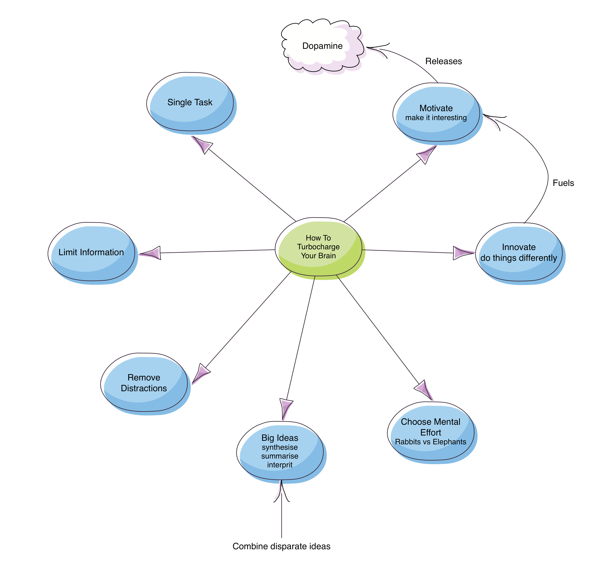

In her [Seven secrets to turbocharge your brain](https://www.youtube.com/watch?v=uUL5o-1Yawo) TED talk, Sandra Chapman mentions the following habits make the most of your brain power:

Turbocharge Your Brain

